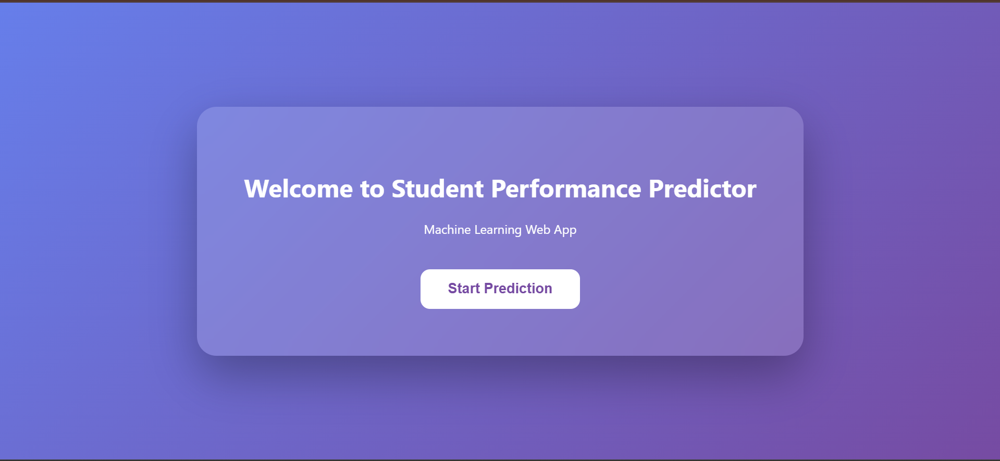
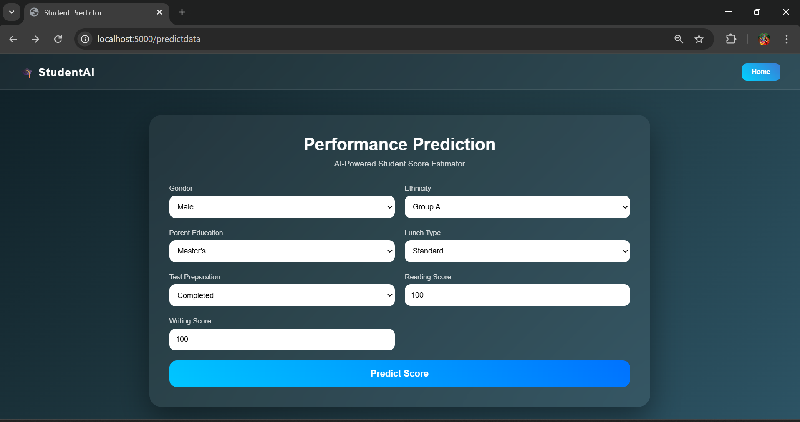

 
  <h1>🎓 Student Performance Indicator</h1> 
  
End‑to‑end Machine Learning Web App — deployed on AWS Elastic Beanstalk
 
  <!-- Badges (replace links if desired) --> 
   
   

---

## 🔹 About This Project
A full-stack **Machine Learning web application** predicting student performance, deployed on **AWS Elastic Beanstalk**. Built using **Python, Flask, and Scikit-learn**, this project demonstrates **end-to-end ML workflow**: data processing → model training → web deployment. Highlights skills in **cloud deployment, backend development, and real-time prediction**, making it a practical portfolio project for recruiters and hiring managers.

🔗 http://student-performance-indicator-env.eba-np6vpmkn.ap-south-2.elasticbeanstalk.com/

Access the live app here

🛠 Tech Stack

Backend & Web Framework: Flask (Python)

Machine Learning: Scikit-learn, Pandas, NumPy

Database: SQLite / PostgreSQL

Frontend: HTML, CSS, Bootstrap

Cloud Deployment: AWS Elastic Beanstalk

Version Control: Git & GitHub

📈 Project Overview

This project predicts student performance based on key features such as attendance, grades, and other metrics.

Key Features:

Input student data through a web interface

Real-time performance prediction

Data-driven insights for teachers and administrators

Fully deployed on AWS for easy access

🖼 Screenshots

**Home Page:**  
  

**Prediction Result Page:**  

🚀 Installation & Setup
Prerequisites

Python 3.x

pip / virtualenv

Git

Steps

Clone the repository:

git clone https://github.com/yeripallivijay/Student-Performance-Indicator-AWS.git

cd Student-Performance-Indicator-AWS

Create and activate a virtual environment:

python -m venv venv
source venv/bin/activate      # Linux/macOS
venv\Scripts\activate         # Windows

Install dependencies:

pip install -r requirements.txt

Run the Flask app locally:

python app.py

Visit http://localhost:8080/ in your browser

☁️ AWS Deployment

Deployed using AWS Elastic Beanstalk

Includes Procfile and requirements.txt for easy deployment

Handles scaling automatically based on traffic

📊 Model Details

Algorithm: Random Forest / CatBoost / Linear Regression / Lasso & Ridge / K-Neighbors Regressor / XGBRegressor	/ AdaBoost Regressor

Accuracy: 90%

Training Dataset: Student performance CSV

Evaluation Metrics: Accuracy, F1-score, Confusion Matrix

📂 Folder Structure
Student-Performance-Indicator-AWS/
├── app.py
├── src/
│   ├── components/
│   └── utils.py
├── templates/
├── static/
├── Notebook/
├── requirements.txt
├── Procfile
└── README.md

📞 Contact

Vijay Yeripalli

GitHub: https://github.com/yeripallivijay

Email: yeripallivijay2003@gmail.com
